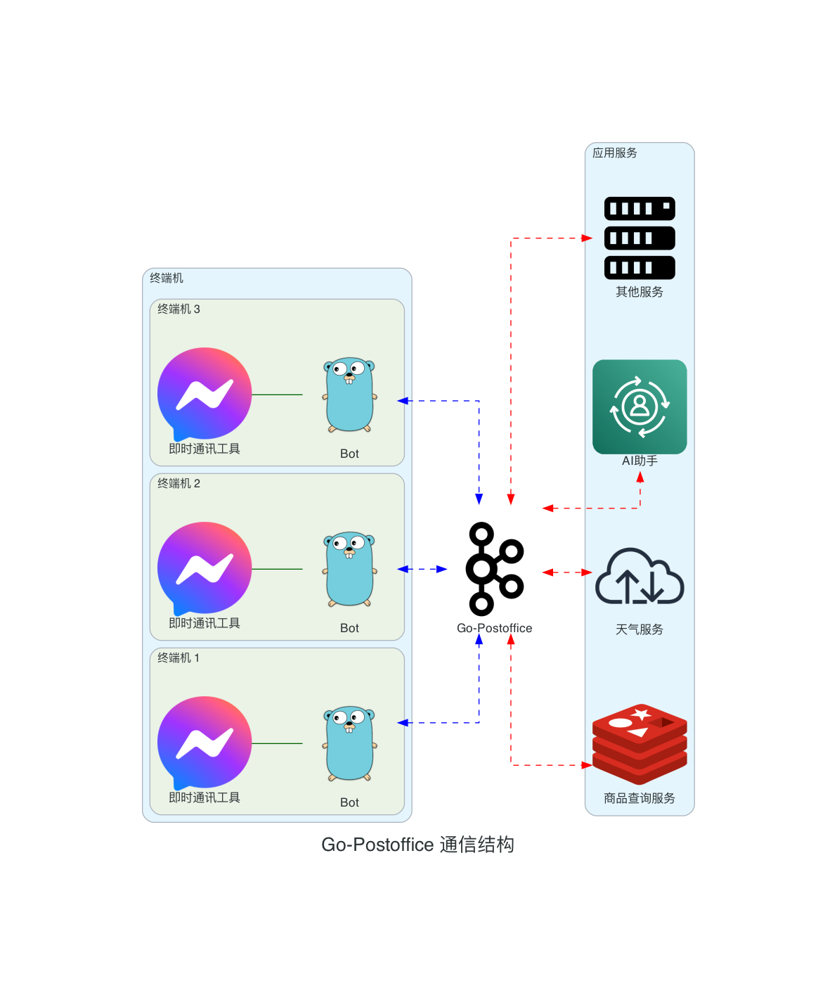

# GO-POSTOFFICE

[English Version](README.md)

GO-POSTOFFICE 是一个基于 Go 语言实现的高性能 WebSocket 服务器，采用邮局概念模型设计。该项目主要处理连接管理、安全认证以及消息（邮件）的分发和投递。



## 目录

1. [特性](#特性)
2. [安装](#安装)
3. [快速开始](#快速开始)
4. [配置](#配置)
5. [API 文档](#api-文档)
6. [消息协议](#消息协议)
7. [客户端示例](#客户端示例)
8. [贡献](#贡献)
9. [许可证](#许可证)

## 特性

1. **高性能并发处理**：利用 Go 的 goroutines 和 channels 实现高效的并发连接管理。
2. **灵活的消息路由**：基于邮局模型，支持点对点和广播消息分发，实现高效的消息投递。
3. **安全认证**：集成令牌认证，确保连接安全。
4. **可配置的消息验证**：支持可选的 JSON Schema 验证，确保消息格式正确性。
5. **环境适应性**：支持多环境配置，便于在不同场景下部署。
6. **优雅的服务管理**：实现优雅启动和关闭机制，保证服务稳定性。
7. **可扩展性**：模块化设计，便于功能扩展和定制。
8. **实时通信**：基于 WebSocket 的全双工通信，支持实时数据交换。

### 邮局模型的优势

- **解耦**：发送者和接收者完全分离，提高系统灵活性。
- **可靠性**：消息持久化和重试机制确保消息可靠投递。
- **可扩展性**：易于添加新的消息类型和处理逻辑。
- **负载均衡**：可实现多个"邮局"实例，提高系统吞吐量。

## 企业级AI聊天机器人快速接入指南
有关如何快速集成企业级AI聊天机器人的详细指南，请参阅我们的[企业级AI聊天机器人接入指南](docs/enterprise_ai_chatbot_integration_guide_cn.md)。

## 安装

确保您的系统已安装 Go（版本 1.23.1 或更高）。

1. 克隆仓库：
   ```
   git clone https://github.com/zlz3907/go-postoffice.git
   ```

2. 进入项目目录：
   ```
   cd go-postoffice
   ```

3. 安装依赖：
   ```
   go mod tidy
   ```

## 快速开始

1. 配置环境：
   复制 `.env/config-dev.json` 到 `.env/config-zhycit.json`，并根据需要修改配置。

2. 运行服务器：
   ```
   go run main.go
   ```

3. 构建可执行文件：

   对于 Linux：
   ```
   env GOOS=linux GOARCH=amd64 go build -ldflags "-X main.env=zhycit" -o dist/go-postoffice-linux
   ```

   对于 macOS：
   ```
   env GOOS=darwin GOARCH=amd64 go build -ldflags "-X main.env=zhycit" -o dist/go-postoffice-macos
   ```

   对于 Windows：
   ```
   env GOOS=windows GOARCH=amd64 go build -ldflags "-X main.env=zhycit" -o dist/go-postoffice-windows.exe
   ```

   注意：如果需要，请将 `zhycit` 替换为您想要的环境名称。

4. 运行构建的可执行文件：

   对于 Linux/macOS：
   ```
   ./dist/go-postoffice-linux   # 或 go-postoffice-macos
   ```

   对于 Windows：
   ```
   .\dist\go-postoffice-windows.exe
   ```

## 配置

主要配置项包括：

- `socketPort`：WebSocket 服务器端口
- `maxWebSocketConnections`：最大连接数
- `dataSource`：数据源配置（如 Redis）

详细配置说明请参阅 [配置文档](docs/configuration.md)。

## API 文档

API 使用说明请参阅 [API 文档](docs/api.md)。

## 消息协议

消息格式和字段说明请参阅 [消息协议文档](docs/message-protocol.md)。

## 客户端示例

- [Go 客户端示例](examples/go-client.go)
- [Java 客户端示例](examples/JavaClient.java)
- [JavaScript 客户端示例](examples/js-client.js)
- [Python 客户端示例](examples/python-client.py)

## 贡献

我们欢迎任何形式的贡献。请阅读 [贡献指南](CONTRIBUTING_CN.md) 了解如何参与项目开发。

## 许可证

本项目采用 Apache 2.0 许可证。详情请见 [LICENSE](LICENSE) 文件。
