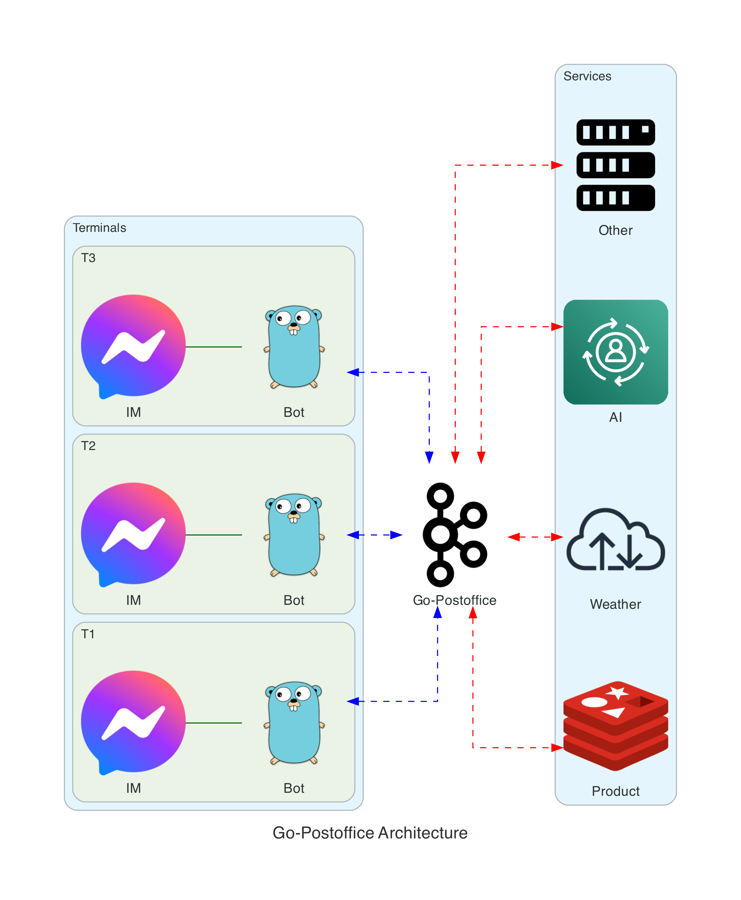

# GO-POSTOFFICE

[中文版](README_CN.md) | [English](README.md)

GO-POSTOFFICE بولسا Go غا ئاساسلانغان يۇقىرى ئۈنۈملۈك WebSocket مۇلازىمېتىر ئەمەلگە ئاشۇرۇلۇشى بولۇپ، پوچتا ئىدارىسى چۈشەنچىسى مودېلى بويىچە لايىھەلەنگەن. بۇ قۇرۇلۇش ئاساسلىقى ئۇلىنىش باشقۇرۇشى، بىخەتەرلىك دەلىللەش ۋە ئۇچۇر (خەت) تارقىتىش ۋە يەتكۈزۈشنى بىر تەرەپ قىلىدۇ.



## مۇندەرىجە

1. [ئالاھىدىلىكلەر](#ئالاھىدىلىكلەر)
2. [قاچىلاش](#قاچىلاش)
3. [تېز باشلاش](#تېز-باشلاش)
4. [سەپلىمە](#سەپلىمە)
5. [API ھۆججەتلىرى](#api-ھۆججەتلىرى)
6. [ئۇچۇر كېلىشىمى](#ئۇچۇر-كېلىشىمى)
7. [خېرىدار مىساللىرى](#خېرىدار-مىساللىرى)
8. [تۆھپە قوشۇش](#تۆھپە-قوشۇش)
9. [ئىجازەتنامە](#ئىجازەتنامە)

## ئالاھىدىلىكلەر

1. **يۇقىرى ئۈنۈملۈك تەڭ ۋاقىتلىق بىر تەرەپ قىلىش**: Go نىڭ goroutines ۋە channels نى ئىشلىتىپ ئۈنۈملۈك تەڭ ۋاقىتلىق ئۇلىنىش باشقۇرۇشىنى ئەمەلگە ئاشۇرىدۇ.
2. **مۇۋاپىقلاشتۇرۇشچان ئۇچۇر يوللاش**: پوچتا ئىدارىسى مودېلىغا ئاساسەن، نۇقتىدىن نۇقتىغا ۋە ئومۇمىي تارقىتىش ئۇچۇر تارقىتىشنى قوللاپ، ئۈنۈملۈك ئۇچۇر يەتكۈزۈشنى ئەمەلگە ئاشۇرىدۇ.
3. **بىخەتەرلىك دەلىللەش**: token دەلىللەشنى قوشۇپ ئۇلىنىش بىخەتەرلىكىنى كاپالەتكە ئىگە قىلىدۇ.
4. **تەڭشىگىلى بولىدىغان ئۇچۇر دەلىللەش**: ئۇچۇر فورماتىنىڭ توغرىلىقىنى كاپالەتكە ئىگە قىلىش ئۈچۈن تاللانما JSON Schema دەلىللەشنى قوللايدۇ.
5. **مۇھىت ماسلىشىشچانلىقى**: ھەر خىل ئەھۋاللاردا ئاسان قۇرۇش ئۈچۈن كۆپ مۇھىت سەپلىمىسىنى قوللايدۇ.
6. **نازۇك مۇلازىمەت باشقۇرۇشى**: مۇلازىمەت مۇقىملىقىنى كاپالەتكە ئىگە قىلىش ئۈچۈن نازۇك قوزغىتىش ۋە توختىتىش مېخانىزمىنى ئەمەلگە ئاشۇرىدۇ.
7. **كېڭەيتىلىشچانلىق**: ئىقتىدار كېڭەيتىش ۋە ئۆزلەشتۈرۈشنى ئاسانلاشتۇرۇش ئۈچۈن مودۇللۇق لايىھە.
8. **ھەقىقىي ۋاقىتلىق ئالاقە**: WebSocket غا ئاساسلانغان تولۇق قوش يۆنىلىشلىك ئالاقە، ھەقىقىي ۋاقىتلىق سانلىق مەلۇمات ئالماشتۇرۇشنى قوللايدۇ.

### پوچتا ئىدارىسى مودېلىنىڭ ئارتۇقچىلىقلىرى

- **ئايرىش**: ئەۋەتكۈچى ۋە قوبۇل قىلغۇچىنى پۈتۈنلەي ئايرىش، سىستېمىنىڭ مۇۋاپىقلاشتۇرۇشچانلىقىنى ئاشۇرىدۇ.
- **ئىشەنچلىكلىك**: ئۇچۇر ساقلاش ۋە قايتا سىناش مېخانىزمى ئىشەنچلىك ئۇچۇر يەتكۈزۈشنى كاپالەتكە ئىگە قىلىدۇ.
- **كېڭەيتىلىشچانلىق**: يېڭى ئۇچۇر تىپلىرى ۋە بىر تەرەپ قىلىش لوگىكىسىنى ئاسانلا قوشقىلى بولىدۇ.
- **يۈك تەڭپۇڭلاشتۇرۇش**: كۆپ «پوچتا ئىدارىسى» ئۈلگىلىرىنى ئەمەلگە ئاشۇرۇپ سىستېمىنىڭ ئۆتكۈزۈش ئىقتىدارىنى ئاشۇرغىلى بولىدۇ.

## كارخانا AI پاراڭلىشىش ئاپپاراتىنى تېز قوشۇش قوللانمىسى
كارخانا دەرىجىلىك AI پاراڭلىشىش ئاپپاراتىنى قانداق تېز قوشۇش توغرىسىدىكى تەپسىلىي قوللانما ئۈچۈن، [كارخانا AI پاراڭلىشىش ئاپپاراتىنى قوشۇش قوللانمىسى](docs/enterprise_ai_chatbot_integration_guide.md) غا قاراڭ.

## قاچىلاش

سىستېمىڭىزدا Go (نەشرى 1.23.1 ياكى ئۇنىڭدىن يۇقىرى) نىڭ قاچىلانغانلىقىنى جەزملەشتۈرۈڭ.

1. ئامبارنى كۆچۈرۈش:
   ```
   git clone https://github.com/zlz3907/go-postoffice.git
   ```

2. قۇرۇلۇش مۇندەرىجىسىگە كىرىش:
   ```
   cd go-postoffice
   ```

3. بېقىنمىلارنى قاچىلاش:
   ```
   go mod tidy
   ```

## تېز باشلاش

1. مۇھىتنى سەپلەش:
   `.env/config-dev.json` نى `.env/config-zhycit.json` غا كۆچۈرۈپ، زۆرۈر بولغاندا سەپلىمىنى ئۆزگەرتىڭ.

2. مۇلازىمېتىرنى ئىجرا قىلىش:
   ```
   go run main.go
   ```

3. ئىجرا قىلىشقا بولىدىغان ھۆججەتنى قۇرۇش:

   Linux ئۈچۈن:
   ```
   env GOOS=linux GOARCH=amd64 go build -ldflags "-X main.env=zhycit" -o dist/go-postoffice-linux
   ```

   macOS ئۈچۈن:
   ```
   env GOOS=darwin GOARCH=amd64 go build -ldflags "-X main.env=zhycit" -o dist/go-postoffice-macos
   ```

   Windows ئۈچۈن:
   ```
   env GOOS=windows GOARCH=amd64 go build -ldflags "-X main.env=zhycit" -o dist/go-postoffice-windows.exe
   ```

   دىققەت: ئەگەر باشقا بولسا `zhycit` نى ئۆزىڭىزنىڭ خالىغان مۇھىت ئىسمى بىلەن ئالماشتۇرۇڭ.

4. قۇرۇلغان ئىجرا قىلىشقا بولىدىغان ھۆججەتنى ئىجرا قىلىش:

   Linux/macOS ئۈچۈن:
   ```
   ./dist/go-postoffice-linux   # ياكى go-postoffice-macos
   ```

   Windows ئۈچۈن:
   ```
   .\dist\go-postoffice-windows.exe
   ```

## سەپلىمە

ئاساسلىق سەپلىمە تۈرلىرى:

- `socketPort`: WebSocket مۇلازىمېتىر پورتى
- `maxWebSocketConnections`: ئەڭ كۆپ ئۇلىنىش سانى
- `dataSource`: سانلىق مەلۇمات مەنبەسى سەپلىمىسى (مەسىلەن، Redis)

تەپسىلىي سەپلىمە كۆرسەتمىلىرى ئۈچۈن [سەپلىمە ھۆججىتى](docs/configuration.md) غا قاراڭ.

## API ھۆججەتلىرى

API ئىشلىتىش كۆرسەتمىلىرى ئۈچۈن [API ھۆججەتلىرى](docs/api.md) غا قاراڭ.

## ئۇچۇر كېلىشىمى

ئۇچۇر فورماتى ۋە خانە چۈشەندۈرۈشلىرى ئۈچۈن [ئۇچۇر كېلىشىمى ھۆججىتى](docs/message-protocol.md) غا قاراڭ.

## خېرىدار مىساللىرى

- [Go خېرىدار مىسالى](examples/go-client.go)
- [Java خېرىدار مىسالى](examples/JavaClient.java)
- [JavaScript خېرىدار مىسالى](examples/js-client.js)
- [Python خېرىدار مىسالى](examples/python-client.py)

## تۆھپە قوشۇش

بىز ھەر قانداق شەكىلدىكى تۆھپىلەرنى قارشى ئالىمىز. قۇرۇلۇش تەرەققىياتىغا قانداق قاتنىشىشنى ئۆگىنىش ئۈچۈن [تۆھپە قوشۇش كۆرسەتمىلىرى](CONTRIBUTING.md) نى ئوقۇڭ.

## ئىجازەتنامە

بۇ قۇرۇلۇش Apache 2.0 ئىجازەتنامىسى ئاستىدا ئىجازەت قىلىنغان. تەپسىلاتلار ئۈچۈن [LICENSE](LICENSE) ھۆججىتىگە قاراڭ.
